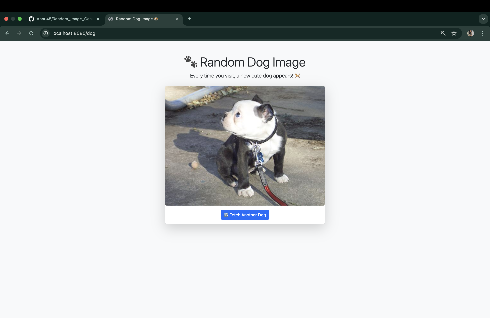

# 🖼️ Random Image Generator (Spring Boot)

A Spring Boot MVC application that fetches and displays random dog images using a public API. Built to demonstrate REST API integration, clean architecture, and MVC design pattern.

---

## 🚀 Features

- ✅ Fetches random dog images via REST API
- ✅ Displays them using a simple HTML + Thymeleaf UI
- ✅ Uses Spring Boot MVC architecture
- ✅ Easy-to-extend and maintain
- ✅ Clean folder structure for beginners and professionals

---

## Screenshot



---

## 🔧 Tech Stack

- Java 17+
- Spring Boot 3.x
- Maven
- Thymeleaf (View Layer)
- Dog API → https://dog.ceo/dog-api/
- Eclipse / IntelliJ

---

## 🛠️ Installation & Run

### 1. Clone the repository

```bash
git clone https://github.com/Annu45/Random_Image_Generator.git
cd Random_Image_Generator
```

### 2. Run using Maven

```bash
./mvnw spring-boot:run
```

OR

### 2. Run via IDE

- Open project in Eclipse or IntelliJ
- Right-click → Run as Spring Boot App

---

## 🌐 API Used

We use [Dog CEO's Dog API](https://dog.ceo/dog-api/) to fetch random dog images.  
Example Endpoint: `https://dog.ceo/api/breeds/image/random`

---

## 📂 Project Structure

```
src
├── main
│   ├── java
│   │   └── com.example.dogapi
│   │       ├── controller
│   │       ├── service
│   │       └── model
│   └── resources
│       ├── templates (Thymeleaf views)
│       └── application.properties
```

---

## 📄 License

This project is licensed under the MIT License - see the [LICENSE](LICENSE) file for details.

---

## 🤝 Contributing

Pull requests are welcome! Feel free to open issues or suggest improvements.

---

## 🙋‍♀️ Author

Made with ❤️ by [Annu Mathur](https://github.com/Annu45)

---
